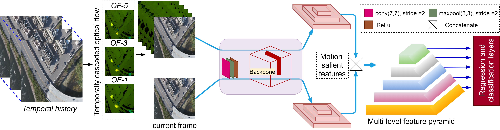
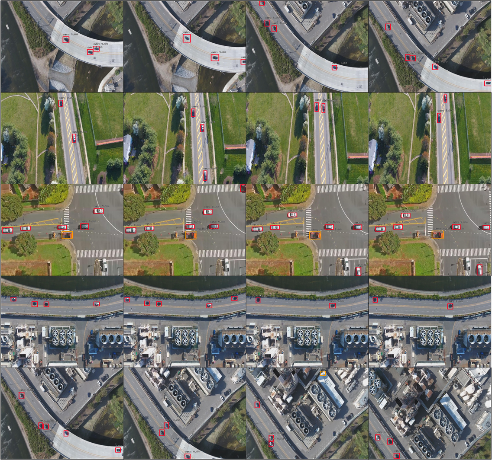

# MOR-UAV

This repository contains a Keras implementation of the paper 'MOR-UAV: A Unified Deep Framework for 'Moving Object Recognition on Unmanned Aerial Vehicles' accepted in ACM MM 2020. To the best of our knowledge, this is a first attempt for simultaneous localization and classification of moving objects in ariel video, i.e. moving object recognition (MOR) on Unmanned Aerial Vehicles (UAV) in a single-stage deep learning framework.

We used the code base of [fizyr/keras-retinanet](https://github.com/fizyr/keras-retinanet) for our work.
We forked off from [fizyr/keras-retinanet](https://github.com/fizyr/keras-retinanet) tag 0.5.1.

## Description

The MOR is one of the essentiale tasks to support various UAV vision-based applications including aerial surveillance, search and rescue, event recognition, urban and rural scene understanding.To the best of our knowledge, no labeled dataset is available for MOR evaluation in UAV videos.
Therefore, in this paper, we introduce MOR-UAV, a large-scale video dataset for MOR in aerial videos. We achieve this by labeling axis-aligned bounding boxes for moving objects which requires less computational resources than producing pixel-level estimates. We annotate 89,783 moving object instances collected from 30 UAV videos, consisting of 10,948 frames in various scenarios such as weather conditions, occlusion, changing flying altitude and multiple camera views. We assigned the labels for two categories of vehicles (car and heavy vehicle).

MOR-UAV is first attempt for MOR in UAV videos, we present 16 baseline results based on the proposed framework over the MOR-UAV dataset through quantitative and qualitative experiments. We also analyze the motion-salient regions in the network through multiple layer visualizations.

## Paper

TODO

## BibTex

@InProceedings{author = {Mandal, Murari and Kumar, Lav Kush and vipparthi, Santosh Kumar},
title = {MOR-UAV: A Benchmark Dataset and Baselines for Moving Object Recognition in UAV Videos},
booktitle = {[ACM International Conference on Multimedia (ACM MM ’20)](https://2020.acmmm.org/)},
month = {July},
year = {2020}
}

## Installation

1) Clone this repository.
2) Ensure numpy is installed using `pip install numpy --user`
3) In the repository, execute `pip install . --user`.
   Note that due to inconsistencies with how `tensorflow` should be installed,
   this package does not define a dependency on `tensorflow` as it will try to install that (which at least on Arch Linux results in an incorrect installation).
   Please make sure `tensorflow` is installed as per your systems requirements.
4) Run `python setup.py build_ext --inplace` to compile Cython code first.

## Training

MOR-UAV can be trained using this train.py script.
Note that the train script uses relative imports since it is inside the keras_retinanet package.

Model can be trained on all csv files in `--csv_path CSV_PATH` folder.
Randomly select a video, read continuous frames, compute the optical map between the current frame and frames from temporal with distance 1, 3 and 5, respectively, perform estimation using resnet 50 and retinanet pyramid.
At end of each video, randomly select new video, start with 5th (Max of previous frame needed for optical flow) frame.

### CSV datasets

The CSV file with annotations should contain one annotation per line. Images with multiple bounding boxes should use one row per bounding box. Note that indexing for pixel values starts at 0. The expected format of each line is:

```shell
path/to/image.jpg,x1,y1,x2,y2,class_name
```

By default the CSV generator will look for images in csv_folder/train/ directory of the annotations (csv) file.

### Class mapping format

The class name to ID mapping file should contain one mapping per line. Each line should use the following format:

```
class_name,id
```

Indexing for classes starts at 0. Do not include a background class as it is implicit.

### Pretrained models

Model summary can be found in model_summary.md.
**Model of trained MOR-UAV model is attached in snapshots folder.**

### Usage

```shell

keras_retinanet/bin/train.py csv classes.csv

Positional arguments:
  {csv}                 Arguments for csv dataset types.

Optional arguments:   
    --backbone BACKBONE   Backbone model used by retinanet. (default : resnet50) 
                one of the backbones in resnet models (resnet50, resnet101, resnet152)  
    --epochs EPOCHS       Number of epochs to train.   
    --steps STEPS         Number of steps per epoch.        (default: 10000)       
    --lr LR               Learning rate.                    (default: 1e-5)             
    --snapshot-path SNAPSHOT_PATH    
                          Path to store snapshots of models during training  
                          (defaults to './snapshots')  
    --previous-optical-diff-list                            default=[1, 3, 5]
                          List of previous historical image frame for optical flow computation
    --initial_epoch INITIAL_EPOCH                           (default: 1)  
                          initial epochs to train.  
    --csv_path CSV_PATH                                     (default: './csv_folder/train/')  
                Path to store csv files for training

```

## Converting a training model to inference model

The training procedure of MOR-UAV works with training models. These are stripped down versions compared to the inference model and only contains the layers necessary for training (regression and classification values). If you wish to do inference on a model (perform object detection on an image), you need to convert the trained model to an inference model.

### Usage

```shell

keras_retinanet/bin/convert_model.py snapshots/resnet50_csv_60.h5 snapshots/model.h5 

positional arguments:
  model_in              The model to convert.
  model_out             Path to save the converted model to.
optional arguments:
  --backbone BACKBONE   The backbone of the model to convert.
```

## Testing

Use the trained model to test the unseen videos.
Model can be tested on all csv files in --csv_path CSV_PATH. And output is stored in  `--save-path SAVE_PATH` folder.

### Usage

```shell

keras_retinanet/bin/evaluate.py csv classes.csv   snapshots/model.h5

positional arguments:
  {csv}                 Arguments for specific dataset types.
  model                 Path to RetinaNet model.

optional arguments:
  --csv_path CSV_PATH   Path to store csv files for training
              (default: './csv_folder/test/')
  --iou-threshold IOU_THRESHOLD
                        IoU Threshold to count for a positive detection
                        (defaults to 0.5).
  --save-path SAVE_PATH
                        Path for saving images with detections
  --previous-optical-diff-list                            default=[1, 3, 5]
                          List of previous historical image frame for optical flow computation
  --test-folder-list                                      default=['test'])
                          List of dirs for evaluating
  ----video_index                                         default=0
                          Video index to compute evealuation for in list of test dirs

```

By default the CSV generator will look for images in `csv_folder/test/` directory of the annotations (csv) file.
Evaluation output is stored in `outputs/FOLDERNAME/`.

## Layer Visualization

MOR-UAV layer can be visualized using `keras_retinanet/bin/visualize.py`

### Usage

```shell

keras_retinanet/bin/visualize.py csv classes.csv   snapshots/model.h5

positional arguments:
  {csv}                 Arguments for specific dataset types.
  model                 Path to RetinaNet model.

Optional arguments:
  --depth DEPTH           Image frame depth.
  --csv_path CSV_PATH     Path to store csv files for layer visualization
  --save-path SAVE_PATH                                 default='./visualize/test/'
                          Path for saving images with visualization
  --layer LAYER           Name of the CNN layer to visualize.
  --layer_size LAYER_SIZE  CNN layer size specified for visualization
   --score-threshold SCORE_THRESHOLD
                        Threshold on score to filter detections with (defaults
                        to 0.05).
  --iou-threshold IOU_THRESHOLD
                        IoU Threshold to count for a positive detection
                        (defaults to 0.5).
  --previous-optical-diff-list                            default=[1, 3, 5]
                          List of previous historical image frame for optical flow computation

```

By default the CSV generator will look for images in `visualize/test/csv/` directory of the annotations (csv) file.
Visualization is stored in `visualize/test/LAYER_NAME/output/`.

## Demo

MOR-UAV model demo can be executed using `keras_retinanet/bin/demo.py`

### Usage

```shell

keras_retinanet/bin/demo.py csv classes.csv   snapshots/model.h5

positional arguments:
  {csv}                 Arguments for specific dataset types.
  model                 Path to RetinaNet model.
optional arguments
    --depth DEPTH         image frame depth.
  --video-path VIDEO_PATH
                        video name
  --previous-optical-diff-list                            default=[1, 3, 5]
                          List of previous historical image frame for optical flow computation

```

## Results

NOTE: **Model of trained MOR-UAV model can be found in snapshots folder.**

<h4 align="center" style="text-align: center">
  </br>

Visualization of pyramid levels P3, P4, P5 and P6.
The relevant  motion  saliencies  of  moving  objects  are  highlighted  using red boxes.

</h4> </br> </br>

<h4 align="center" style="text-align: center;margin: auto;">
  </br>

Sample video frames taken from MOR-UAV. The videos are collected from different scenarios including night time, occlusion,
camera motion, weather conditions, camera views, etc. The red and green boxes denote two object classes car and heavy-vehicle
respectively

</h4> </br> </br>

<h4 align="center" style="text-align: center">
  </br>

Schematic illustration of the proposed UAV-MotionRec framework for MOR in UAV videos

</h4> </br> </br>

<h4 align="center" style="text-align: center;">
  </br></br>
  <a href="https://www.youtube.com/watch?v=QiAZ1FiBKEc&t=6s&ab_channel=LavKush" target="_blank"></a></br></br>
 Qualitative results of UAV-MotionRec over completely unseen video sequences in MOR-UAV dataset. Only the moving
objects are localized and classified. The non-moving objects in the video frame are neglected by the MOR algorithm
</h4> </br> </br>

## Contributors

Lav Kush Kumar          (lavkushkumarmnit@gmail.com)
Murari Mandal           (murarimandal.cv@gmail.com)
Santosh Kumar Vipparthi (skvipparthi@mnit.ac.in)

We forked off from [fizyr/keras-retinanet](https://github.com/fizyr/keras-retinanet) tag 0.5.1.
Thanks to fizyr/keras-retinanet team.

## TODO

Realtime demo of MOR-UAV model.
